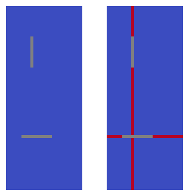
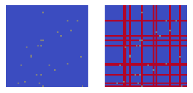

.. _Optimask:

.. image:: https://img.shields.io/pypi/v/optimask.svg
    :target: https://pypi.org/project/optimask

.. image:: https://anaconda.org/conda-forge/optimask/badges/version.svg
    :target: https://anaconda.org/conda-forge/optimask

.. image:: https://anaconda.org/conda-forge/optimask/badges/downloads.svg
    :target: https://anaconda.org/conda-forge/optimask

OptiMask Documentation
######################

.. toctree::
   :hidden:
   :maxdepth: 1   

   notebook
   api_reference
   future

``OptiMask`` is a Python package designed for efficiently handling NaN values in matrices, specifically focusing on computing the largest
non-contiguous submatrix without NaN. In contrast to optimal but computationally expensive linear programming approaches, OptiMask
employs a heuristic method, relying solely on Numpy for speed and efficiency. In machine learning applications, OptiMask surpasses
traditional methods like pandas ``dropna`` by maximizing the amount of valid data available for model fitting. It strategically
identifies the optimal set of columns (features) and rows (samples) to retain or remove, ensuring that the largest (non-contiguous)
submatrix without NaN is utilized for training models.

The problem differs from the computation of the largest rectangles of 1s in a binary matrix (which can be tackled with dynamic programming)
and requires a novel approach.

Basic Usage
-----------

To use OptiMask, you can create an instance of the ``OptiMask`` class and apply the ``solve`` method to find the optimal rows and
columns for a given 2D array or DataFrame. Here's a basic example:

.. code-block:: python

   from optimask import OptiMask
   import numpy as np

   # Create a matrix with NaN values
   data = np.zeros((60, 25))
   data[17, 5:15] = np.nan
   data[40:50, 8] = np.nan

   # Solve for the largest submatrix without NaN values
   rows, cols = OptiMask().solve(data)

   # Print the results
   print(f"Optimal Rows: {rows}")
   print(f"Optimal Columns: {cols}")

The grey cells represent the NaN locations, the blue ones represent the valid data, and the red ones represent the rows and columns removed by the algorithm:

``OptiMask``'s algorithm is useful for handling unstructured NaN patterns, as shown in the following example:

For more detailed information on the parameters and usage, refer to the :ref:`API reference <api_reference>`.

Repository
----------

The source code of the package is available at `<https://github.com/CyrilJl/OptiMask>`_.
